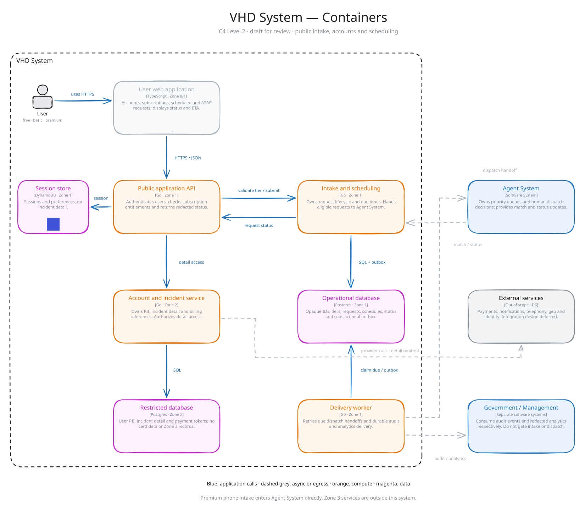

# VHD

Vought Hero Dispatcher

This is a system that supports hero assistants to help people more effectively across the globe. Learn more about the [company](https://www.youtube.com/@voughtintl) that sets human equality and safety first!

## Architecture review

Agent System: [SVG](diagrams/dist/c2-agent-system.svg) · [Design notes](docs/architecture/02-agent-containers.md)


[View C2 as SVG](diagrams/dist/c2-vhd-system.svg) ·
[Editable Excalidraw](diagrams/dist/c2-vhd-system.excalidraw) ·
[Design notes](docs/architecture/01-vhd-containers.md)



### Export from the CLI

One-time setup (Node.js 18+):

```sh
npm ci
npx playwright install chromium
# Linux only, if browser system libraries are missing (requires admin):
npx playwright install-deps chromium
```

Export an existing scene without opening the interactive preview:

```sh
npm run diagram:export -- diagrams/dist/c2-vhd-system.excalidraw diagrams/dist/c2-vhd-system.svg
```

The exporter uses Excalidraw's own SVG renderer in headless Chromium, with local
fonts and assets. It starts
and closes a temporary loopback server automatically; scene data stays local.
Exported files can be opened directly, with no Node.js or server needed to view
them. To update a diagram after editing its source, run `npm run diagram:build`,
then `npm run diagram:lint`, then the export command above. The CLI accepts any
`.excalidraw` scene; SVG is the repository’s review format.
